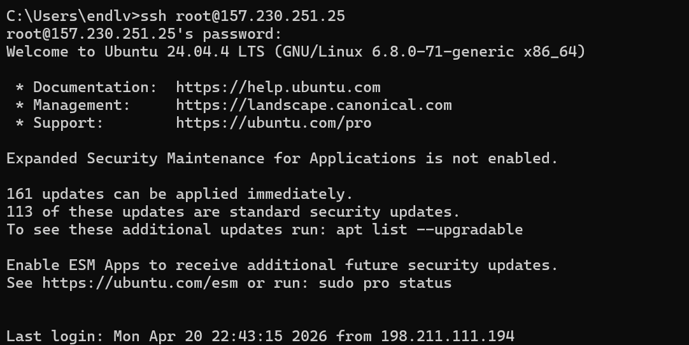
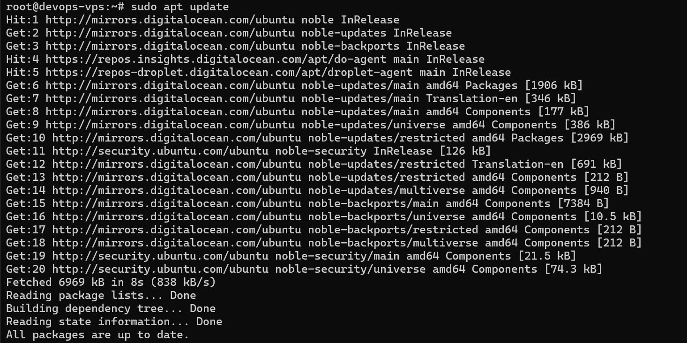
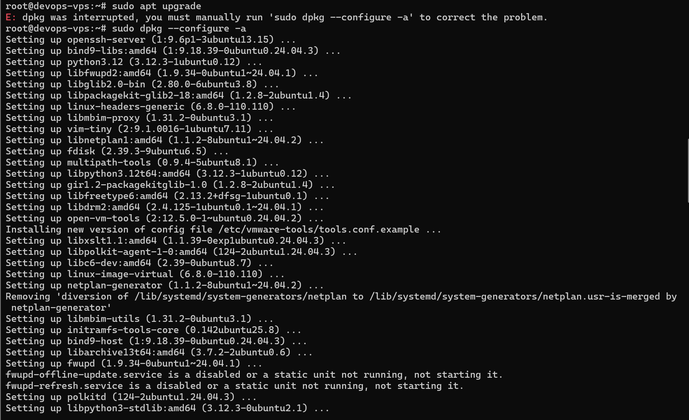
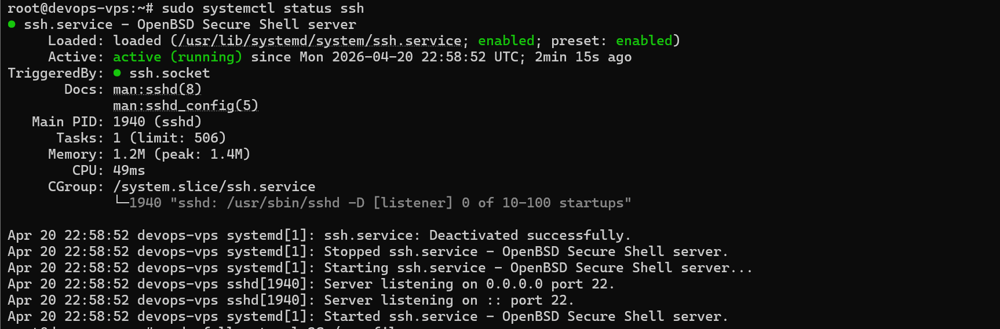
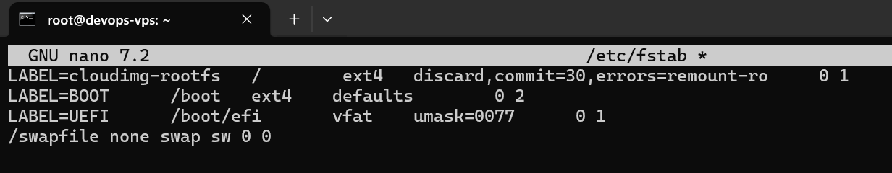
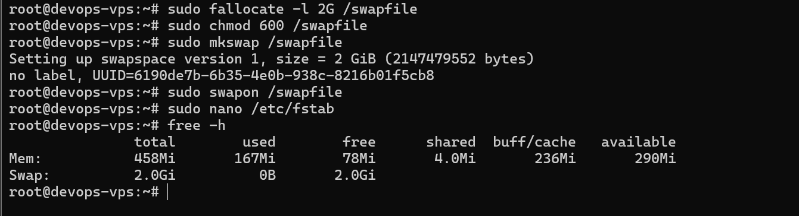

# Tugas 6 - VPS Provisioning

## Tujuan
Melakukan inisialisasi VPS agar siap digunakan dengan:
- Update & upgrade sistem
- Setup swap memory 2GB
- Verifikasi hasil setup

---

## Langkah-langkah

### 1. Login ke VPS
Melakukan SSH ke server VPS.

---

### 2. Update Sistem
Menjalankan update package list.

---

### 3. Upgrade Sistem
Melakukan upgrade package.

---

### 4. Setup Swap Memory 2GB
Melakukan:
- fallocate
- chmod
- mkswap
- swapon

---

### 5. Konfigurasi Permanent Swap
Menambahkan swap ke file `/etc/fstab`.

---

### 6. Verifikasi
Memastikan swap aktif menggunakan `free -h`.

---

## Kesimpulan
Swap memory sebesar 2GB berhasil dibuat dan aktif, serta akan tetap berjalan setelah reboot.